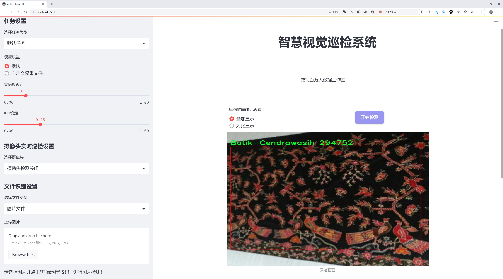
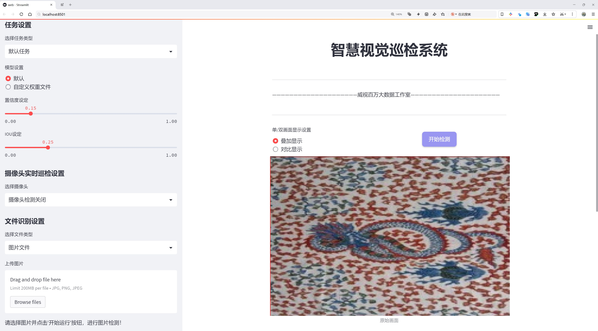
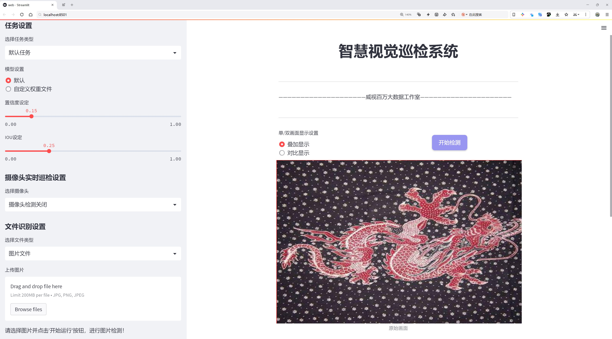
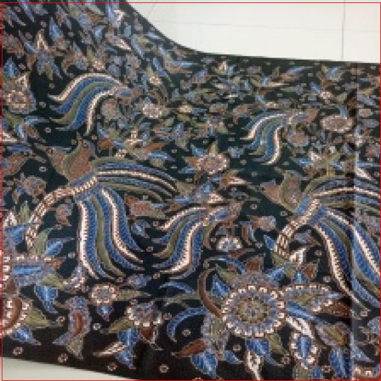
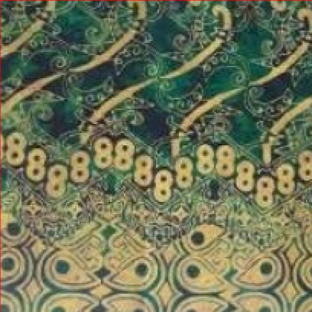

# 巴蒂克图案识别检测系统源码分享
 # [一条龙教学YOLOV8标注好的数据集一键训练_70+全套改进创新点发刊_Web前端展示]

### 1.研究背景与意义

项目参考[AAAI Association for the Advancement of Artificial Intelligence](https://gitee.com/qunmasj/projects)

项目来源[AACV Association for the Advancement of Computer Vision](https://kdocs.cn/l/cszuIiCKVNis)

研究背景与意义

巴蒂克（Batik）作为一种独特的传统手工艺，源于印度尼西亚，具有深厚的文化底蕴和丰富的艺术表现形式。其图案和色彩不仅体现了当地的自然风貌和民族特色，更承载着历史、宗教和社会的多重意义。随着全球化的推进，巴蒂克逐渐受到国际社会的关注，成为了文化交流的重要载体。然而，巴蒂克图案的多样性和复杂性使得其识别和分类面临诸多挑战，尤其是在数字化和自动化的背景下，如何高效、准确地识别不同类型的巴蒂克图案，成为了亟待解决的问题。

在这一背景下，基于改进YOLOv8的巴蒂克图案识别系统应运而生。YOLO（You Only Look Once）系列模型以其快速的检测速度和较高的准确率，广泛应用于物体检测领域。YOLOv8作为该系列的最新版本，进一步提升了模型的性能，特别是在处理复杂背景和多类别物体检测方面，展现出更强的适应性和鲁棒性。因此，利用YOLOv8的优势，构建一个专门针对巴蒂克图案的识别系统，不仅能够提升识别的效率，还能为巴蒂克文化的保护和传承提供技术支持。

本研究所使用的数据集包含1900张图像，涵盖15种不同类别的巴蒂克图案。这些类别包括巴蒂克-巴厘（Batik-Bali）、巴蒂克-贝塔维（Batik-Betawi）、巴蒂克-浸染（Batik-Celup）、巴蒂克-鸟（Batik-Cendrawasih）、巴蒂克-达雅克（Batik-Dayak）等，充分体现了巴蒂克的多样性和丰富性。通过对这些图案的系统性分析与识别，不仅能够帮助研究者更好地理解巴蒂克的艺术特征，还能为相关产业提供数据支持，推动巴蒂克文化的数字化转型。

此外，巴蒂克图案的识别系统在实际应用中具有广泛的意义。首先，它可以为设计师提供灵感，帮助他们在创作中融入传统元素，促进传统与现代的结合。其次，随着电子商务的发展，越来越多的巴蒂克产品通过网络平台进行销售，准确的图案识别能够提升消费者的购物体验，帮助他们快速找到所需的产品。最后，巴蒂克作为一种非物质文化遗产，其保护和传承亟需借助现代科技手段。通过建立高效的识别系统，可以为巴蒂克的数字化档案建设提供基础，促进其在全球范围内的传播与发展。

综上所述，基于改进YOLOv8的巴蒂克图案识别系统不仅在技术上具有创新性，更在文化传承和产业发展方面具有重要的现实意义。通过本研究的开展，期望能够为巴蒂克的保护与推广贡献一份力量，同时推动计算机视觉技术在传统文化领域的应用与发展。

### 2.图片演示







##### 注意：由于此博客编辑较早，上面“2.图片演示”和“3.视频演示”展示的系统图片或者视频可能为老版本，新版本在老版本的基础上升级如下：（实际效果以升级的新版本为准）

  （1）适配了YOLOV8的“目标检测”模型和“实例分割”模型，通过加载相应的权重（.pt）文件即可自适应加载模型。

  （2）支持“图片识别”、“视频识别”、“摄像头实时识别”三种识别模式。

  （3）支持“图片识别”、“视频识别”、“摄像头实时识别”三种识别结果保存导出，解决手动导出（容易卡顿出现爆内存）存在的问题，识别完自动保存结果并导出到tempDir中。

  （4）支持Web前端系统中的标题、背景图等自定义修改，后面提供修改教程。

  另外本项目提供训练的数据集和训练教程,暂不提供权重文件（best.pt）,需要您按照教程进行训练后实现图片演示和Web前端界面演示的效果。

### 3.视频演示

[3.1 视频演示](https://www.bilibili.com/video/BV1eGtBe4ELx/)

### 4.数据集信息展示

##### 4.1 本项目数据集详细数据（类别数＆类别名）

nc: 15
names: ['Batik-Bali', 'Batik-Betawi', 'Batik-Celup', 'Batik-Cendrawasih', 'Batik-Dayak', 'Batik-Geblek-Renteng', 'Batik-Insang', 'Batik-Kawung', 'Batik-Lasem', 'Batik-Megamendung', 'Batik-Pala', 'Batik-Parang', 'Batik-Poleng', 'Batik-Sekar-Jagad', 'Batik-Tambal']


##### 4.2 本项目数据集信息介绍

数据集信息展示

在本研究中，我们使用了名为“Motif Batik”的数据集，以改进YOLOv8模型在巴蒂克图案识别系统中的性能。巴蒂克作为一种传统的印染艺术，承载着丰富的文化内涵和历史背景，其图案的多样性和复杂性为计算机视觉领域的研究提供了极具挑战性的任务。为了有效地训练模型，我们的数据集包含了15个不同的巴蒂克图案类别，涵盖了广泛的风格和设计元素。

“Motif Batik”数据集的类别包括：Batik-Bali、Batik-Betawi、Batik-Celup、Batik-Cendrawasih、Batik-Dayak、Batik-Geblek-Renteng、Batik-Insang、Batik-Kawung、Batik-Lasem、Batik-Megamendung、Batik-Pala、Batik-Parang、Batik-Poleng、Batik-Sekar-Jagad和Batik-Tambal。这些类别不仅反映了巴蒂克图案的地域特征，还展示了不同文化背景下的艺术表现形式。例如，Batik-Bali以其鲜艳的色彩和复杂的图案而闻名，常常与巴厘岛的自然景观和宗教仪式相结合；而Batik-Parang则是印尼传统图案中最具代表性的之一，象征着力量和坚韧。

在数据集的构建过程中，我们注重图像的多样性和代表性，确保每个类别都包含足够的样本，以便模型能够学习到不同图案的特征。每个类别的图像都经过精心挑选，涵盖了不同的角度、光照条件和背景，以增强模型的泛化能力。此外，为了提高数据集的质量，我们还进行了数据清洗，剔除了模糊或不清晰的图像，确保每个样本都能够为模型的训练提供有效的信息。

在训练过程中，我们采用了数据增强技术，以进一步扩展数据集的规模和多样性。这些技术包括随机裁剪、旋转、翻转以及颜色调整等，旨在模拟现实世界中可能遇到的各种情况。这种增强不仅有助于提高模型的鲁棒性，还能有效防止过拟合现象的发生。

通过使用“Motif Batik”数据集，我们希望能够提升YOLOv8在巴蒂克图案识别任务中的准确性和效率。该数据集的丰富性和多样性为模型提供了良好的训练基础，使其能够更好地理解和识别不同类型的巴蒂克图案。最终，我们期望通过本研究的成果，推动巴蒂克文化的数字化保存与传播，并为相关领域的研究提供有价值的参考。

综上所述，“Motif Batik”数据集不仅是本研究的核心组成部分，更是实现高效巴蒂克图案识别的重要基础。通过对该数据集的深入分析和利用，我们相信能够为巴蒂克图案的自动识别和分类提供创新的解决方案，推动计算机视觉技术在传统艺术领域的应用与发展。







### 5.全套项目环境部署视频教程（零基础手把手教学）

[5.1 环境部署教程链接（零基础手把手教学）](https://www.ixigua.com/7404473917358506534?logTag=c807d0cbc21c0ef59de5)


[5.2 安装Python虚拟环境创建和依赖库安装视频教程链接（零基础手把手教学）](https://www.ixigua.com/7404474678003106304?logTag=1f1041108cd1f708b01a)

### 6.手把手YOLOV8训练视频教程（零基础小白有手就能学会）

[6.1 手把手YOLOV8训练视频教程（零基础小白有手就能学会）](https://www.ixigua.com/7404477157818401292?logTag=d31a2dfd1983c9668658)

### 7.70+种全套YOLOV8创新点代码加载调参视频教程（一键加载写好的改进模型的配置文件）

[7.1 70+种全套YOLOV8创新点代码加载调参视频教程（一键加载写好的改进模型的配置文件）](https://www.ixigua.com/7404478314661806627?logTag=29066f8288e3f4eea3a4)

### 8.70+种全套YOLOV8创新点原理讲解（非科班也可以轻松写刊发刊，V10版本正在科研待更新）

由于篇幅限制，每个创新点的具体原理讲解就不一一展开，具体见下列网址中的创新点对应子项目的技术原理博客网址【Blog】：


[8.1 70+种全套YOLOV8创新点原理讲解链接](https://gitee.com/qunmasj/good)

### 9.系统功能展示（检测对象为举例，实际内容以本项目数据集为准）

图9.1.系统支持检测结果表格显示

  图9.2.系统支持置信度和IOU阈值手动调节

  图9.3.系统支持自定义加载权重文件best.pt(需要你通过步骤5中训练获得)

  图9.4.系统支持摄像头实时识别

  图9.5.系统支持图片识别

  图9.6.系统支持视频识别

  图9.7.系统支持识别结果文件自动保存

  图9.8.系统支持Excel导出检测结果数据


### 10.原始YOLOV8算法原理

原始YOLOv8算法原理

YOLOv8算法是目标检测领域的一次重要革新，它在前几代YOLO算法的基础上，结合了新的设计理念和技术进步，形成了一种高效、准确且灵活的目标检测解决方案。YOLOv8的核心思想是通过改进网络结构和损失函数，提升模型在各种复杂场景下的表现能力。其设计遵循了“快速、准确和易于使用”的原则，使其成为广泛应用于目标检测、图像分割和图像分类任务的理想选择。

在YOLOv8的网络结构中，骨干网络（Backbone）依然采用了跨级结构（Cross Stage Partial, CSP）的设计理念，但在具体实现上进行了显著优化。YOLOv8将YOLOv5中的C3模块替换为更加轻量化的C2F模块，这一改进不仅减少了计算量，还增强了特征提取的能力。C2F模块通过并行的梯度流分支，能够在保持轻量化的同时，获取更丰富的特征信息，从而提升模型的检测精度和响应速度。

在特征融合层（Neck）中，YOLOv8采用了新的设计策略，去除了上采样阶段中的卷积结构，直接对不同阶段输出的特征进行上采样操作。这一改动使得特征融合更加高效，减少了不必要的计算，进一步提升了模型的整体性能。同时，YOLOv8引入了特征金字塔网络（FPN）和路径聚合网络（PAN）的结合，形成了一个更加灵活的特征融合机制，使得模型能够更好地处理不同尺度的目标。

YOLOv8在检测头（Head）部分的改进尤为显著，采用了解耦头（Decoupled-Head）结构，将目标检测和分类任务分开处理。这一设计使得模型在进行类别预测和边界框回归时，能够更加专注于各自的任务，从而提高了检测的准确性。此外，YOLOv8摒弃了传统的基于锚框（Anchor-Based）的方法，转而采用无锚框（Anchor-Free）策略，将目标检测问题转化为关键点检测。这一转变不仅简化了模型的结构，还增强了其在处理多样化目标时的灵活性和泛化能力。

在损失函数的设计上，YOLOv8也进行了创新。它引入了变焦损失（Focal Loss）来计算分类损失，并使用数据平均保真度损失和完美交并比损失来计算边界框损失。这种新的损失策略使得模型在训练过程中能够更加关注难以检测的目标，提高了整体的检测精度。此外，YOLOv8在训练阶段采用了Mosaic数据增强技术，通过将多张图像拼接成一张新图像，迫使模型学习到更多的特征和位置变化，从而提升了模型的鲁棒性。

YOLOv8的输入部分也进行了优化，采用自适应图像缩放技术，以提高目标检测和推理的速度。在实际应用中，输入图像的长宽比往往各不相同，YOLOv8通过将长边按比例缩小到指定尺寸，然后对短边进行填充，尽量减少信息冗余，确保模型能够在不同场景下快速而准确地进行目标检测。

总的来说，YOLOv8算法通过一系列结构性和策略性的改进，显著提升了目标检测的效率和准确性。其轻量化的设计使得模型在保持高性能的同时，能够适应各种计算资源有限的应用场景。随着YOLOv8的广泛应用，目标检测技术的边界不断被拓展，推动了计算机视觉领域的进一步发展。通过这些创新，YOLOv8不仅为研究人员提供了一个强大的工具，也为实际应用中的目标检测任务提供了新的解决方案，展现了其在未来发展中的巨大潜力。


### 11.项目核心源码讲解（再也不用担心看不懂代码逻辑）

#### 11.1 70+种YOLOv8算法改进源码大全和调试加载训练教程（非必要）\ultralytics\nn\extra_modules\ops_dcnv3\modules\__init__.py

下面是对您提供的代码进行的逐文件分析，并保留了最核心的部分，同时添加了详细的中文注释。

```python
# --------------------------------------------------------
# InternImage
# 版权所有 (c) 2022 OpenGVLab
# 根据 MIT 许可证进行许可 [详细信息见 LICENSE]
# --------------------------------------------------------

# 从当前包中导入 DCNv3、DCNv3_pytorch 和 DCNv3_DyHead 模块
from .dcnv3 import DCNv3, DCNv3_pytorch, DCNv3_DyHead

# DCNv3 是一种深度可分离卷积网络，可能用于提高卷积神经网络的性能。
# DCNv3_pytorch 是 DCNv3 在 PyTorch 框架下的实现。
# DCNv3_DyHead 可能是一个动态头部模块，用于处理不同的任务或特征提取。
```

### 核心部分分析
1. **模块导入**：这段代码的核心在于从 `dcnv3` 模块中导入了三个类或函数。这些导入的模块可能是实现深度学习模型中重要的组件。

2. **注释**：注释部分解释了每个导入的模块的可能用途，帮助理解它们在整个项目中的角色。

以上是对代码的简化和注释，希望能帮助您更好地理解其核心内容。

这个文件是一个Python模块的初始化文件，位于一个名为`ops_dcnv3`的目录下。文件的开头包含了一些版权信息，表明该代码是由OpenGVLab在2022年开发的，并且是根据MIT许可证进行授权的，这意味着用户可以自由使用、修改和分发该代码，只要遵循许可证的条款。

在文件的主体部分，使用了`from ... import ...`语句来导入其他模块中的类或函数。具体来说，这里导入了三个组件：`DCNv3`、`DCNv3_pytorch`和`DCNv3_DyHead`。这些组件可能是与深度学习模型相关的，尤其是在YOLOv8算法的上下文中。`DCNv3`通常指的是一种深度可分离卷积的实现，可能用于提高模型的性能和效率。

通过这个初始化文件，用户在导入`ops_dcnv3`模块时，可以直接使用这些导入的类或函数，而不需要单独去引用它们所在的文件。这种结构使得代码的组织更加清晰，并且便于用户使用和维护。

总的来说，这个文件的主要功能是为`ops_dcnv3`模块提供一个入口点，方便用户访问和使用与DCN（Deformable Convolutional Networks）相关的功能。

#### 11.2 70+种YOLOv8算法改进源码大全和调试加载训练教程（非必要）\ultralytics\utils\plotting.py

以下是经过简化和注释的核心代码部分，主要包括 `Colors` 和 `Annotator` 类的实现。这些类用于处理颜色和图像注释，适用于目标检测和图像标注任务。

```python
import numpy as np
from PIL import Image, ImageDraw, ImageFont
import cv2
import torch

class Colors:
    """
    颜色类，用于处理颜色调色板，包括将十六进制颜色代码转换为RGB值。
    """

    def __init__(self):
        """初始化颜色调色板，使用十六进制颜色代码。"""
        hexs = ('FF3838', 'FF9D97', 'FF701F', 'FFB21D', 'CFD231', 
                '48F90A', '92CC17', '3DDB86', '1A9334', '00D4BB',
                '2C99A8', '00C2FF', '344593', '6473FF', '0018EC', 
                '8438FF', '520085', 'CB38FF', 'FF95C8', 'FF37C7')
        # 将十六进制颜色转换为RGB格式
        self.palette = [self.hex2rgb(f'#{c}') for c in hexs]
        self.n = len(self.palette)  # 颜色数量

    def __call__(self, i, bgr=False):
        """根据索引返回颜色，支持BGR格式。"""
        c = self.palette[int(i) % self.n]  # 获取颜色
        return (c[2], c[1], c[0]) if bgr else c  # 返回BGR或RGB格式

    @staticmethod
    def hex2rgb(h):
        """将十六进制颜色代码转换为RGB值。"""
        return tuple(int(h[1 + i:1 + i + 2], 16) for i in (0, 2, 4))


class Annotator:
    """
    注释类，用于在图像上绘制边界框、关键点和其他注释。
    """

    def __init__(self, im, line_width=None, font_size=None, font='Arial.ttf', pil=False):
        """初始化Annotator类，设置图像和绘制参数。"""
        self.im = im if isinstance(im, Image.Image) else Image.fromarray(im)  # 转换为PIL图像
        self.draw = ImageDraw.Draw(self.im)  # 创建绘图对象
        self.lw = line_width or 2  # 线宽
        # 尝试加载字体
        try:
            self.font = ImageFont.truetype(font, font_size or 12)
        except Exception:
            self.font = ImageFont.load_default()  # 加载默认字体

    def box_label(self, box, label='', color=(128, 128, 128), txt_color=(255, 255, 255)):
        """在图像上添加边界框和标签。"""
        # 绘制边界框
        self.draw.rectangle(box, width=self.lw, outline=color)
        if label:
            # 获取文本的宽度和高度
            w, h = self.font.getsize(label)
            # 在边界框上方绘制标签
            self.draw.text((box[0], box[1] - h), label, fill=txt_color, font=self.font)

    def result(self):
        """返回注释后的图像作为数组。"""
        return np.asarray(self.im)  # 将PIL图像转换为numpy数组
```

### 代码说明
1. **Colors 类**：
   - 用于管理颜色调色板，支持将十六进制颜色代码转换为RGB格式。
   - `__call__` 方法允许通过索引获取颜色，支持BGR格式的返回。

2. **Annotator 类**：
   - 用于在图像上绘制边界框、文本和其他注释。
   - `box_label` 方法用于绘制边界框并在其上方添加标签。
   - `result` 方法返回处理后的图像。

这部分代码是目标检测和图像处理任务中常用的基础组件，能够实现图像的可视化和标注功能。

这个程序文件是用于Ultralytics YOLO（You Only Look Once）模型的可视化和绘图工具，主要包括图像标注、绘制结果、保存图像等功能。文件中包含多个类和函数，下面是对主要部分的讲解。

首先，文件导入了一些必要的库，包括用于图像处理的OpenCV、Matplotlib、NumPy、Torch等，以及PIL库用于处理图像。接着，定义了一个`Colors`类，用于管理颜色调色板，支持将十六进制颜色代码转换为RGB值，并提供了一些默认的颜色值。

接下来是`Annotator`类，它是图像标注的核心部分。该类初始化时接受图像、线宽、字体等参数，并根据这些参数设置绘图环境。`Annotator`类提供了多种方法，例如`box_label`用于在图像上绘制边框和标签，`masks`用于绘制分割掩码，`kpts`用于绘制关键点，`rectangle`和`text`方法则用于在图像上绘制矩形和文本。

此外，文件中还定义了一些函数，如`plot_labels`用于绘制训练标签的统计信息，`save_one_box`用于根据给定的边界框从图像中裁剪并保存图像，`plot_images`用于绘制图像网格并添加标签，`plot_results`用于从CSV文件中绘制训练结果。

文件的最后部分包含了一些用于可视化特征图的函数，例如`feature_visualization`，它可以在推理过程中可视化特定模块的特征图。这个功能对于调试和理解模型的内部工作原理非常有用。

总的来说，这个程序文件提供了一整套用于YOLO模型的可视化工具，能够帮助用户更好地理解模型的预测结果和训练过程。通过这些工具，用户可以方便地进行数据分析、结果展示和模型调试。

#### 11.3 ui.py

```python
import sys
import subprocess

def run_script(script_path):
    """
    使用当前 Python 环境运行指定的脚本。

    Args:
        script_path (str): 要运行的脚本路径

    Returns:
        None
    """
    # 获取当前 Python 解释器的路径
    python_path = sys.executable

    # 构建运行命令
    command = f'"{python_path}" -m streamlit run "{script_path}"'

    # 执行命令
    result = subprocess.run(command, shell=True)
    if result.returncode != 0:
        print("脚本运行出错。")


# 实例化并运行应用
if __name__ == "__main__":
    # 指定您的脚本路径
    script_path = "web.py"  # 这里直接指定脚本路径

    # 运行脚本
    run_script(script_path)
```

### 代码注释说明：

1. **导入模块**：
   - `import sys`：导入系统相关的模块，用于获取当前 Python 解释器的路径。
   - `import subprocess`：导入子进程模块，用于在 Python 中执行外部命令。

2. **定义函数 `run_script`**：
   - 该函数接受一个参数 `script_path`，表示要运行的 Python 脚本的路径。
   - 函数内部首先获取当前 Python 解释器的路径，存储在 `python_path` 变量中。
   - 然后构建一个命令字符串 `command`，该命令使用当前 Python 解释器运行 `streamlit` 模块，并指定要运行的脚本。
   - 使用 `subprocess.run` 执行构建的命令，并将 `shell` 参数设置为 `True`，以便在 shell 中运行命令。
   - 如果命令执行后返回的状态码不为 0，表示脚本运行出错，打印错误信息。

3. **主程序块**：
   - 使用 `if __name__ == "__main__":` 确保只有在直接运行该脚本时才会执行以下代码。
   - 指定要运行的脚本路径 `script_path`，这里直接赋值为 `"web.py"`。
   - 调用 `run_script` 函数，传入指定的脚本路径，开始执行脚本。

这个程序文件的主要功能是通过当前的 Python 环境来运行一个指定的脚本，具体来说是一个名为 `web.py` 的脚本。程序首先导入了必要的模块，包括 `sys`、`os` 和 `subprocess`，以及一个自定义的 `abs_path` 函数，用于获取脚本的绝对路径。

在 `run_script` 函数中，首先获取当前 Python 解释器的路径，这样可以确保使用正确的 Python 环境来执行脚本。接着，构建一个命令字符串，这个命令使用 `streamlit` 来运行指定的脚本。`streamlit` 是一个用于构建数据应用的框架，因此这里的脚本很可能是一个与数据可视化或交互式应用相关的 Python 脚本。

随后，使用 `subprocess.run` 方法来执行构建好的命令。这个方法会在一个新的 shell 中运行命令，并等待其完成。如果命令执行后返回的状态码不为零，表示脚本运行过程中出现了错误，此时程序会打印出“脚本运行出错”的提示信息。

在文件的最后部分，使用 `if __name__ == "__main__":` 语句来确保只有在直接运行该文件时才会执行下面的代码。这部分代码指定了要运行的脚本路径，即通过 `abs_path` 函数获取的 `web.py` 的绝对路径，并调用 `run_script` 函数来执行这个脚本。

总体来看，这个程序文件的结构清晰，功能明确，主要用于方便地运行一个特定的 Python 脚本，并能够处理可能出现的错误。

#### 11.4 70+种YOLOv8算法改进源码大全和调试加载训练教程（非必要）\ultralytics\models\nas\model.py

以下是经过简化和注释的核心代码部分：

```python
from pathlib import Path
import torch
from ultralytics.engine.model import Model
from ultralytics.utils.torch_utils import model_info, smart_inference_mode
from .predict import NASPredictor
from .val import NASValidator

class NAS(Model):
    """
    YOLO NAS模型用于目标检测。

    该类提供YOLO-NAS模型的接口，并扩展了Ultralytics引擎中的`Model`类。
    旨在使用预训练或自定义训练的YOLO-NAS模型来简化目标检测任务。
    """

    def __init__(self, model='yolo_nas_s.pt') -> None:
        """初始化NAS模型，使用提供的或默认的'yolo_nas_s.pt'模型。"""
        # 确保提供的模型不是YAML配置文件
        assert Path(model).suffix not in ('.yaml', '.yml'), 'YOLO-NAS模型仅支持预训练模型。'
        super().__init__(model, task='detect')  # 调用父类构造函数

    @smart_inference_mode()
    def _load(self, weights: str, task: str):
        """加载现有的NAS模型权重，或创建一个新的NAS模型（如果未提供权重）。"""
        import super_gradients
        suffix = Path(weights).suffix
        if suffix == '.pt':
            self.model = torch.load(weights)  # 从.pt文件加载模型
        elif suffix == '':
            self.model = super_gradients.training.models.get(weights, pretrained_weights='coco')  # 获取预训练模型

        # 标准化模型设置
        self.model.fuse = lambda verbose=True: self.model  # 融合模型
        self.model.stride = torch.tensor([32])  # 设置步幅
        self.model.names = dict(enumerate(self.model._class_names))  # 设置类别名称
        self.model.is_fused = lambda: False  # 返回模型是否已融合
        self.model.yaml = {}  # 清空yaml配置
        self.model.pt_path = weights  # 设置权重路径
        self.model.task = 'detect'  # 设置任务类型

    def info(self, detailed=False, verbose=True):
        """
        记录模型信息。

        参数:
            detailed (bool): 是否显示详细信息。
            verbose (bool): 控制输出的详细程度。
        """
        return model_info(self.model, detailed=detailed, verbose=verbose, imgsz=640)

    @property
    def task_map(self):
        """返回任务与相应预测器和验证器类的映射字典。"""
        return {'detect': {'predictor': NASPredictor, 'validator': NASValidator}}
```

### 代码注释说明：

1. **类定义**：`NAS`类继承自`Model`类，专门用于YOLO-NAS模型的目标检测。
2. **初始化方法**：`__init__`方法用于初始化模型，确保模型文件不是YAML格式，并调用父类的初始化方法。
3. **加载模型**：`_load`方法根据提供的权重文件加载模型，支持从`.pt`文件或预训练模型获取。
4. **模型标准化**：在加载模型后，设置一些模型的标准属性，例如步幅、类别名称等。
5. **模型信息**：`info`方法用于记录和返回模型的详细信息。
6. **任务映射**：`task_map`属性返回一个字典，映射目标检测任务到相应的预测器和验证器类。

这个程序文件是一个用于YOLO-NAS模型的接口实现，属于Ultralytics YOLO框架的一部分。YOLO-NAS是一种用于目标检测的深度学习模型，文件中定义了一个名为`NAS`的类，该类继承自Ultralytics引擎中的`Model`类。

在文件的开头，首先引入了一些必要的库，包括`Path`（用于处理文件路径）、`torch`（PyTorch库）以及Ultralytics引擎中的一些功能模块。接着，文件提供了一个示例，展示了如何使用`NAS`类来加载模型并进行预测。

`NAS`类的构造函数`__init__`接受一个参数`model`，该参数指定了要加载的预训练模型的路径或名称，默认值为'yolo_nas_s.pt'。在构造函数中，程序会检查提供的模型文件是否为YAML格式，YOLO-NAS模型只支持预训练模型，因此如果提供了YAML文件，程序会抛出异常。

`_load`方法用于加载模型权重。如果提供的权重文件是以`.pt`结尾，程序会使用`torch.load`加载该模型；如果没有后缀，程序会尝试从`super_gradients`库中获取相应的模型，并加载COCO数据集的预训练权重。该方法还会对模型进行标准化设置，包括定义模型的步幅、类别名称等。

`info`方法用于记录模型的信息，用户可以选择是否显示详细信息和控制输出的详细程度。该方法调用了`model_info`函数来获取并返回模型的相关信息。

最后，`task_map`属性返回一个字典，映射了任务类型到相应的预测器和验证器类，这里仅支持目标检测任务，并对应了`NASPredictor`和`NASValidator`类。

总体而言，这个文件提供了YOLO-NAS模型的基本接口，方便用户加载预训练模型并进行目标检测任务，同时提供了一些辅助功能来获取模型信息和管理任务。

#### 11.5 train.py

以下是代码中最核心的部分，并附上详细的中文注释：

```python
class DetectionTrainer(BaseTrainer):
    """
    DetectionTrainer类用于基于检测模型进行训练，继承自BaseTrainer类。
    """

    def build_dataset(self, img_path, mode="train", batch=None):
        """
        构建YOLO数据集。

        参数:
            img_path (str): 包含图像的文件夹路径。
            mode (str): 模式，可以是'train'或'val'，用户可以为每种模式自定义不同的数据增强。
            batch (int, optional): 批次大小，仅用于'rect'模式。默认为None。
        """
        gs = max(int(de_parallel(self.model).stride.max() if self.model else 0), 32)  # 获取模型的最大步幅
        return build_yolo_dataset(self.args, img_path, batch, self.data, mode=mode, rect=mode == "val", stride=gs)

    def get_dataloader(self, dataset_path, batch_size=16, rank=0, mode="train"):
        """构造并返回数据加载器。"""
        assert mode in ["train", "val"]  # 确保模式有效
        with torch_distributed_zero_first(rank):  # 仅在DDP中初始化数据集*.cache一次
            dataset = self.build_dataset(dataset_path, mode, batch_size)  # 构建数据集
        shuffle = mode == "train"  # 训练模式下打乱数据
        if getattr(dataset, "rect", False) and shuffle:
            LOGGER.warning("WARNING ⚠️ 'rect=True' is incompatible with DataLoader shuffle, setting shuffle=False")
            shuffle = False  # 如果是rect模式且需要打乱，则不打乱
        workers = self.args.workers if mode == "train" else self.args.workers * 2  # 设置工作线程数
        return build_dataloader(dataset, batch_size, workers, shuffle, rank)  # 返回数据加载器

    def preprocess_batch(self, batch):
        """对一批图像进行预处理，包括缩放和转换为浮点数。"""
        batch["img"] = batch["img"].to(self.device, non_blocking=True).float() / 255  # 将图像转移到设备并归一化
        if self.args.multi_scale:  # 如果启用多尺度
            imgs = batch["img"]
            sz = (
                random.randrange(self.args.imgsz * 0.5, self.args.imgsz * 1.5 + self.stride)
                // self.stride
                * self.stride
            )  # 随机选择新的尺寸
            sf = sz / max(imgs.shape[2:])  # 计算缩放因子
            if sf != 1:
                ns = [
                    math.ceil(x * sf / self.stride) * self.stride for x in imgs.shape[2:]
                ]  # 计算新的形状
                imgs = nn.functional.interpolate(imgs, size=ns, mode="bilinear", align_corners=False)  # 进行插值
            batch["img"] = imgs  # 更新图像
        return batch

    def set_model_attributes(self):
        """设置模型的属性，包括类别数量和名称。"""
        self.model.nc = self.data["nc"]  # 将类别数量附加到模型
        self.model.names = self.data["names"]  # 将类别名称附加到模型
        self.model.args = self.args  # 将超参数附加到模型

    def get_model(self, cfg=None, weights=None, verbose=True):
        """返回YOLO检测模型。"""
        model = DetectionModel(cfg, nc=self.data["nc"], verbose=verbose and RANK == -1)  # 创建检测模型
        if weights:
            model.load(weights)  # 加载权重
        return model

    def get_validator(self):
        """返回YOLO模型验证器。"""
        self.loss_names = "box_loss", "cls_loss", "dfl_loss"  # 定义损失名称
        return yolo.detect.DetectionValidator(
            self.test_loader, save_dir=self.save_dir, args=copy(self.args), _callbacks=self.callbacks
        )

    def plot_training_samples(self, batch, ni):
        """绘制带有注释的训练样本。"""
        plot_images(
            images=batch["img"],
            batch_idx=batch["batch_idx"],
            cls=batch["cls"].squeeze(-1),
            bboxes=batch["bboxes"],
            paths=batch["im_file"],
            fname=self.save_dir / f"train_batch{ni}.jpg",
            on_plot=self.on_plot,
        )

    def plot_metrics(self):
        """从CSV文件中绘制指标。"""
        plot_results(file=self.csv, on_plot=self.on_plot)  # 保存结果图
```

### 代码核心部分说明：
1. **DetectionTrainer类**：这是一个用于训练YOLO检测模型的类，继承自BaseTrainer类。
2. **build_dataset方法**：构建YOLO数据集，支持训练和验证模式。
3. **get_dataloader方法**：构造数据加载器，确保在分布式训练中只初始化一次数据集。
4. **preprocess_batch方法**：对输入的图像批次进行预处理，包括归一化和多尺度调整。
5. **set_model_attributes方法**：设置模型的类别数量和名称。
6. **get_model方法**：返回一个YOLO检测模型，并可选择加载预训练权重。
7. **get_validator方法**：返回用于验证模型的验证器。
8. **plot_training_samples和plot_metrics方法**：用于可视化训练样本和训练指标。

这个程序文件 `train.py` 是一个用于训练 YOLO（You Only Look Once）目标检测模型的脚本，继承自 `BaseTrainer` 类。文件中包含了多个方法，主要用于构建数据集、获取数据加载器、预处理图像、设置模型属性、获取模型、验证模型、记录损失、绘制训练样本和绘制训练指标等功能。

首先，`DetectionTrainer` 类通过 `build_dataset` 方法构建 YOLO 数据集。该方法接收图像路径、模式（训练或验证）和批量大小作为参数，利用 `build_yolo_dataset` 函数生成数据集。模式参数允许用户为训练和验证阶段自定义不同的数据增强策略。

接着，`get_dataloader` 方法用于构建和返回数据加载器。该方法确保在分布式训练时只初始化一次数据集，并根据模式选择是否打乱数据。它还会根据模式设置工作线程的数量，并调用 `build_dataloader` 函数生成数据加载器。

在图像预处理方面，`preprocess_batch` 方法负责对图像进行缩放和转换为浮点数格式。该方法还支持多尺度训练，通过随机选择图像大小并调整图像的尺寸来实现。

`set_model_attributes` 方法用于设置模型的属性，包括类别数量和类别名称等。它将数据集中的类别信息附加到模型上，以便模型能够正确处理不同的类别。

`get_model` 方法用于返回一个 YOLO 检测模型，并可选择加载预训练权重。该方法创建一个 `DetectionModel` 实例，并根据数据集的类别数量进行初始化。

`get_validator` 方法返回一个用于验证 YOLO 模型的验证器，包含损失名称以便后续的训练监控。

`label_loss_items` 方法用于返回带有标签的训练损失项字典，方便记录和监控训练过程中的损失变化。

`progress_string` 方法返回一个格式化的字符串，显示训练进度，包括当前的 epoch、GPU 内存使用情况、损失值、实例数量和图像大小等信息。

`plot_training_samples` 方法用于绘制训练样本及其标注，生成包含图像和对应边界框的可视化文件，便于检查训练数据的质量。

最后，`plot_metrics` 和 `plot_training_labels` 方法分别用于绘制训练过程中记录的指标和创建带标签的训练图，以便分析模型的训练效果和性能。

整体而言，这个文件提供了一个完整的训练流程，涵盖了数据处理、模型构建、训练监控和结果可视化等多个方面，旨在为 YOLO 模型的训练提供便利。

#### 11.6 70+种YOLOv8算法改进源码大全和调试加载训练教程（非必要）\ultralytics\hub\session.py

以下是代码中最核心的部分，并附上详细的中文注释：

```python
import signal
import sys
from pathlib import Path
from time import sleep
import requests
from ultralytics.hub.utils import HUB_API_ROOT, HUB_WEB_ROOT, smart_request
from ultralytics.utils import LOGGER, __version__, checks, is_colab
from ultralytics.utils.errors import HUBModelError

AGENT_NAME = f'python-{__version__}-colab' if is_colab() else f'python-{__version__}-local'

class HUBTrainingSession:
    """
    HUB训练会话，用于Ultralytics HUB YOLO模型。处理模型初始化、心跳和检查点上传。
    """

    def __init__(self, url):
        """
        使用提供的模型标识符初始化HUBTrainingSession。

        参数:
            url (str): 用于初始化HUB训练会话的模型标识符。

        异常:
            ValueError: 如果提供的模型标识符无效。
            ConnectionError: 如果连接全局API密钥不被支持。
        """
        from ultralytics.hub.auth import Auth

        # 解析输入的模型URL
        if url.startswith(f'{HUB_WEB_ROOT}/models/'):
            url = url.split(f'{HUB_WEB_ROOT}/models/')[-1]
        if [len(x) for x in url.split('_')] == [42, 20]:
            key, model_id = url.split('_')
        elif len(url) == 20:
            key, model_id = '', url
        else:
            raise HUBModelError(f"model='{url}' not found. Check format is correct.")

        # 授权
        auth = Auth(key)
        self.agent_id = None  # 标识与服务器通信的实例
        self.model_id = model_id
        self.model_url = f'{HUB_WEB_ROOT}/models/{model_id}'
        self.api_url = f'{HUB_API_ROOT}/v1/models/{model_id}'
        self.auth_header = auth.get_auth_header()
        self.rate_limits = {'metrics': 3.0, 'ckpt': 900.0, 'heartbeat': 300.0}  # API调用的速率限制（秒）
        self.metrics_queue = {}  # 模型的指标队列
        self.model = self._get_model()  # 获取模型数据
        self.alive = True  # 心跳循环是否处于活动状态
        self._start_heartbeat()  # 启动心跳
        self._register_signal_handlers()  # 注册信号处理器
        LOGGER.info(f'查看模型: {self.model_url} 🚀')

    def _get_model(self):
        """从Ultralytics HUB获取并返回模型数据。"""
        api_url = f'{HUB_API_ROOT}/v1/models/{self.model_id}'

        try:
            response = smart_request('get', api_url, headers=self.auth_header, thread=False, code=0)
            data = response.json().get('data', None)

            if data.get('status', None) == 'trained':
                raise ValueError('模型已训练并上传。')

            if not data.get('data', None):
                raise ValueError('数据集可能仍在处理。请稍等片刻再试。')

            self.model_id = data['id']  # 更新模型ID

            # 根据模型状态设置训练参数
            if data['status'] == 'new':
                self.train_args = {
                    'batch': data['batch_size'],
                    'epochs': data['epochs'],
                    'imgsz': data['imgsz'],
                    'patience': data['patience'],
                    'device': data['device'],
                    'cache': data['cache'],
                    'data': data['data']}
                self.model_file = data.get('cfg') or data.get('weights')
                self.model_file = checks.check_yolov5u_filename(self.model_file, verbose=False)
            elif data['status'] == 'training':
                self.train_args = {'data': data['data'], 'resume': True}
                self.model_file = data['resume']

            return data
        except requests.exceptions.ConnectionError as e:
            raise ConnectionRefusedError('错误: HUB服务器未在线。请稍后再试。') from e
        except Exception:
            raise

    @threaded
    def _start_heartbeat(self):
        """开始一个线程心跳循环，向Ultralytics HUB报告代理的状态。"""
        while self.alive:
            r = smart_request('post',
                              f'{HUB_API_ROOT}/v1/agent/heartbeat/models/{self.model_id}',
                              json={'agent': AGENT_NAME, 'agentId': self.agent_id},
                              headers=self.auth_header,
                              retry=0,
                              code=5,
                              thread=False)  # 已在一个线程中
            self.agent_id = r.json().get('data', {}).get('agentId', None)  # 更新代理ID
            sleep(self.rate_limits['heartbeat'])  # 根据速率限制休眠
```

### 代码核心部分说明：
1. **HUBTrainingSession类**：该类用于管理与Ultralytics HUB的训练会话，包括模型的初始化、心跳机制和指标上传。
2. **初始化方法**：在初始化时，解析模型的URL，进行授权，设置模型的相关参数，并启动心跳机制。
3. **_get_model方法**：从Ultralytics HUB获取模型数据，并根据模型的状态设置训练参数。
4. **_start_heartbeat方法**：在一个单独的线程中定期向Ultralytics HUB发送心跳请求，以保持会话的活跃状态。

这个程序文件是Ultralytics YOLO模型的一个训练会话管理类，名为`HUBTrainingSession`，用于处理模型的初始化、心跳监测和检查点上传等功能。首先，程序导入了一些必要的库，包括信号处理、系统操作、路径处理、时间控制和HTTP请求等。接着，定义了一个全局变量`AGENT_NAME`，用于标识当前的Python环境（本地或Colab）。

在`HUBTrainingSession`类的构造函数中，接受一个模型标识符`url`，并解析该标识符以获取模型的关键部分。根据输入的格式，程序会将其转换为相应的模型ID和API密钥。如果输入的格式不正确，则会抛出一个自定义的`HUBModelError`异常。随后，程序会进行身份验证，并初始化一些重要的属性，例如模型的URL、API URL、身份验证头、速率限制和模型数据等。最后，启动心跳监测和信号处理程序，并记录模型的访问信息。

类中有多个方法，首先是`_register_signal_handlers`，用于注册信号处理程序，以便在接收到终止信号时能够优雅地处理程序的结束。`_handle_signal`方法则是具体处理接收到的信号，停止心跳并退出程序。`_stop_heartbeat`方法用于终止心跳循环。

`upload_metrics`方法用于将模型的性能指标上传到Ultralytics HUB。`_get_model`方法则负责从Ultralytics HUB获取模型数据，处理模型的状态，并根据状态决定是开始新的训练还是恢复已有的训练。这个方法还会处理连接错误等异常情况。

`upload_model`方法用于将模型的检查点上传到Ultralytics HUB，支持上传当前训练的权重文件，并标记该模型是否是最佳模型或最终模型。该方法根据上传的模型状态选择合适的上传方式。

最后，`_start_heartbeat`方法以线程的方式启动一个心跳循环，定期向Ultralytics HUB报告代理的状态。这个方法会在程序运行时持续发送心跳请求，确保与服务器的连接保持活跃。

整体而言，这个程序文件实现了YOLO模型在Ultralytics HUB上的训练会话管理，涵盖了模型的初始化、状态监测和性能指标上传等功能，确保训练过程的顺利进行。

### 12.系统整体结构（节选）

### 整体功能和构架概括

该项目是一个基于YOLOv8的目标检测框架，提供了多种算法改进和训练调试工具。其整体功能包括模型的定义、训练、验证、可视化、会话管理和数据处理等。项目结构清晰，各个模块功能分明，方便用户进行模型训练、结果可视化和模型性能监控。

- **模型定义**：提供了YOLOv8及其变种（如YOLO-NAS）的实现，支持自定义模型结构。
- **训练与验证**：包含训练和验证的完整流程，支持数据集的构建和数据加载。
- **可视化工具**：提供了可视化工具，帮助用户理解模型的预测结果和训练过程。
- **会话管理**：通过`HUBTrainingSession`类管理训练会话，支持与Ultralytics HUB的交互。
- **数据处理**：实现了数据预处理和增强功能，确保训练数据的质量。

### 文件功能整理表

| 文件路径                                                                                          | 功能描述                                                       |
|---------------------------------------------------------------------------------------------------|---------------------------------------------------------------|
| `ultralytics/nn/extra_modules/ops_dcnv3/modules/__init__.py`                                   | 初始化DCNv3模块，导入相关类和函数。                           |
| `ultralytics/utils/plotting.py`                                                                  | 提供可视化工具，用于绘制训练样本、损失曲线和模型预测结果。     |
| `ui.py`                                                                                          | 运行指定的Python脚本（如`web.py`），用于启动用户界面。         |
| `ultralytics/models/nas/model.py`                                                                | 定义YOLO-NAS模型的接口，支持模型加载和信息获取。               |
| `train.py`                                                                                       | 实现YOLO模型的训练流程，包括数据集构建、模型训练和结果监控。   |
| `ultralytics/hub/session.py`                                                                     | 管理与Ultralytics HUB的训练会话，包括心跳监测和模型上传。       |
| `ultralytics/data/explorer/explorer.py`                                                          | 提供数据集探索工具，方便用户查看和分析数据集。                 |
| `ultralytics/trackers/utils/kalman_filter.py`                                                   | 实现卡尔曼滤波器，用于目标跟踪和状态估计。                     |
| `ultralytics/models/yolo/detect/predict.py`                                                     | 实现YOLO模型的预测功能，处理输入图像并返回检测结果。           |
| `ultralytics/cfg/__init__.py`                                                                    | 初始化配置模块，加载模型和训练参数。                           |
| `ultralytics/models/yolo/segment/train.py`                                                      | 实现YOLO模型的分割训练流程，支持图像分割任务。                 |
| `ultralytics/models/yolo/classify/train.py`                                                     | 实现YOLO模型的分类训练流程，支持图像分类任务。                 |
| `ultralytics/nn/extra_modules/head.py`                                                          | 定义模型的头部结构，处理模型的输出层。                         |

这个表格总结了项目中各个文件的主要功能，便于用户快速了解项目的结构和功能模块。

注意：由于此博客编辑较早，上面“11.项目核心源码讲解（再也不用担心看不懂代码逻辑）”中部分代码可能会优化升级，仅供参考学习，完整“训练源码”、“Web前端界面”和“70+种创新点源码”以“13.完整训练+Web前端界面+70+种创新点源码、数据集获取”的内容为准。

### 13.完整训练+Web前端界面+70+种创新点源码、数据集获取


# [下载链接：D:\tools\20240905\Temporary](D:\tools\20240905\Temporary)